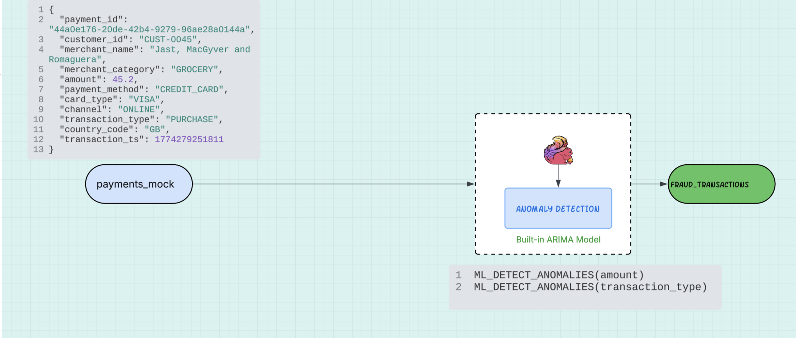

# ML Functions on Confluent Cloud Quickstart

[](https://www.confluent.io/get-started/?utm_campaign=tm.pmm_cd.q4fy25-quickstart-ai-ml-functions&utm_source=github&utm_medium=demo)

Build real-time ML pipelines with [Confluent Cloud](https://www.confluent.io/confluent-cloud/). This quickstart provisions core Confluent infrastructure (Kafka, Flink, Schema Registry) and includes hands-on labs using Confluent's built-in Flink ML functions.

<table>
<tr>
<th width="25%">Lab</th>
<th width="75%">Description</th>
</tr>
<tr>
<td><a href="./FintechLab-Walkthrough.md"><strong>Fintech Lab – Payment Fraud Detection</strong></a></td>
<td>Real-time fraud detection on a synthetic payments stream using <code>ML_DETECT_ANOMALIES</code> with ARIMA to flag spikes in average transaction size and unusual cash advance patterns.<br><br></td>
</tr>
<tr>
<td><a href="./PaymentFraudPipeline-Walkthrough.md"><strong>Payment Fraud Pipeline – End-to-End AI Pipeline</strong></a></td>
<td>A multi-stage real-time payment fraud detection pipeline using Flink SQL sanction filtering, context enrichment via JOIN, <code>ML_PREDICT</code> with OpenAI GPT-4o for risk scoring, and a Confluent Streaming Agent (<code>AI_RUN_AGENT</code>) for autonomous resolution and compliance escalation. No local producers or consumers — all processing runs as Flink SQL jobs.</td>
</tr>
</table>


## Prerequisites

**Required accounts & credentials:**

- [](https://www.confluent.io/get-started/?utm_campaign=tm.pmm_cd.q4fy25-quickstart-ai-ml-functions&utm_source=github&utm_medium=demo)

**Required tools:**

- **[Confluent CLI](https://docs.confluent.io/confluent-cli/current/overview.html)** - must be logged in
- **[Git](https://github.com/git/git)**
- **[Terraform](https://github.com/hashicorp/terraform)**
- **[uv](https://github.com/astral-sh/uv)**

<details>
<summary> Installation commands (Mac/Windows)</summary>
**Mac:**

```bash
brew install uv git python && brew tap hashicorp/tap && brew install hashicorp/tap/terraform && brew install --cask confluent-cli
```

**Windows:**

```powershell
winget install astral-sh.uv Git.Git Hashicorp.Terraform ConfluentInc.Confluent-CLI Python.Python
```
</details>

## Quick Start

**1. Clone the repository and navigate to the Quickstart directory:**

```bash
git clone https://github.com/confluentinc/fintechLab.git
cd fintechLab
```

**2. One command deployment:**

```bash
uv run deploy
```

> **Tip:** If you see a `401 Unauthorized` error during deployment (often caused by stale state from a previous run), use the `--clean` flag to wipe local state and start fresh:
> ```bash
> uv run deploy --clean
> ```

That's it! The script will guide you through setup and deploy the fintech_lab by default.

## Directory Structure

```
quickstart-ai-ml-functions/
├── terraform/
│   ├── core/              # Shared Confluent Cloud infra for all labs
│   └── fintech_lab/       # Fintech Lab resources
├── scripts/deploy.py      # Start here with uv run deploy
└── scripts/               # Python utilities invoked with uv
```

## Cleanup

```bash
# Destroy everything (all labs + core infrastructure)
uv run destroy

# Or destroy a specific lab
uv run destroy payment_fraud_pipeline
```

## Sign up for early access to Flink AI features

For early access to exciting new Flink AI features, [fill out this form and we'll add you to our early access previews.](https://events.confluent.io/early-access-flink-features)
